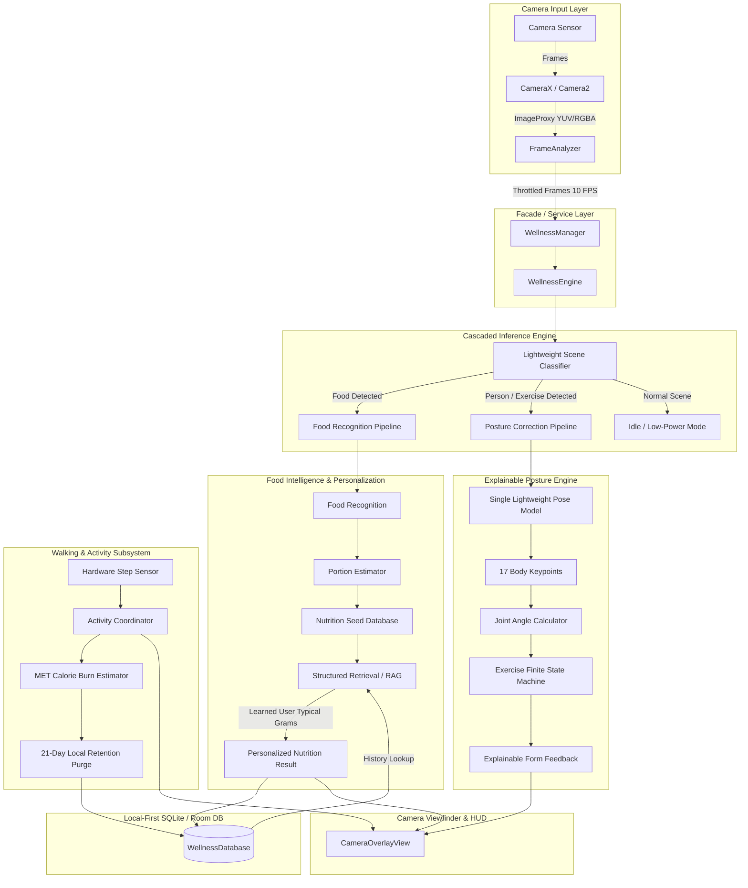

# System Architecture: iQOO Wellness AI Engine
## OEM-Ready Camera Intelligence Platform

### 1. Architectural Philosophy
The iQOO Wellness AI Engine is built on the principle of **Camera-Native Intelligence**:
- The camera serves as a continuous real-time visual sensor.
- The intelligence engine sits downstream of the camera, extracting actionable context without coupling to the camera's UI implementation.
- All intelligence is evaluated **on-device**; no frames, embeddings, or personal health records leave the hardware.

---

### 2. High-Level Data Flow



---

### 3. Cascaded Inference Strategy (Thermals & Battery)
On modern flagship devices like iQOO, thermal throttling and battery drain are critical considerations. Continuously evaluating heavy deep neural networks (such as 3D pose estimation and dense food segmentation) at 30 or 60 FPS would cause rapid thermal ramp-up within minutes.

To prevent this, the engine employs a two-tier cascaded pipeline:
1. **Tier 1 (Lightweight Scene Intent):** A fast, low-complexity classifier analyzes sub-sampled frames at 5–10 FPS. It categorizes the scene into:
   - `FOOD_SCENE`
   - `EXERCISE_SCENE`
   - `NORMAL_SCENE`
2. **Tier 2 (Targeted Domain Pipeline):**
   - If `FOOD_SCENE` is detected: The Food Pipeline is engaged. The pose estimation engine remains completely dormant.
   - If `EXERCISE_SCENE` is detected: The Pose Pipeline is engaged. The food segmentation engine remains dormant.
   - If `NORMAL_SCENE`: No heavy models run. Power consumption drops to near-zero processing overhead.

---

### 4. Structured RAG / Retrieval-Based Personalization
Instead of impractical on-device model fine-tuning (which requires backpropagation, labeled gradients, and substantial GPU/NPU compute), the platform achieves personalization through **local structured retrieval**:

```
[Camera Frame: Dish Detected]
             │
             ▼
[Vision Model]: Identified as "Chicken Biryani" (Confidence 94%)
             │
             ▼
[Local Room SQLite Query]:
SELECT confirmed_grams, count(*) as freq 
FROM portion_history 
WHERE food_id = 'biryani_01' 
ORDER BY timestamp DESC LIMIT 5;
             │
             ├─ If History Found: Typical user portion = 250g
             └─ If First Encounter: Default standard portion = 200g
             │
             ▼
[Nutrition Scaling]:
Calories = (250g / 100g) * 165 kcal = 412.5 kcal
Protein  = (250g / 100g) * 12.5g   = 31.25g
             │
             ▼
[UI Feedback]: "Biryani recognized — using your typical portion ~250g"
```

---

### 5. Deterministic Posture State Machines
Unlike black-box generative models, exercise posture correction uses deterministic 3D/2D trigonometry:
- Key joint angles:
  $$\theta = \arccos\left(\frac{\vec{u} \cdot \vec{v}}{\|\vec{u}\| \|\vec{v}\|}\right)$$
- Each exercise is governed by a strict state machine:
  `READY` $\rightarrow$ `IN_REP` $\rightarrow$ `PEAK_CONTRACTION` $\rightarrow$ `REP_COMPLETED` (or `FORM_FAULT`).
- When a form violation occurs (e.g. knees passing toes excessively during a squat), an immediate explainable hint is produced (e.g., *"Shift hips back, knees over ankles"*).

---

### 6. Activity Tracking & Privacy Guarantee
- Steps are acquired from Android's hardware `Sensor.TYPE_STEP_COUNTER`.
- Active calories are estimated via standard MET (Metabolic Equivalent of Task) values.
- **Privacy & Retention Policy:** To protect user privacy and conserve local storage, persistent daily activity records are strictly constrained to a **21-day rolling window**. A background SQLite cleanup worker enforces:
  ```sql
  DELETE FROM daily_activity WHERE date_epoch < (strftime('%s', 'now') - 21 * 86400) * 1000;
  ```
